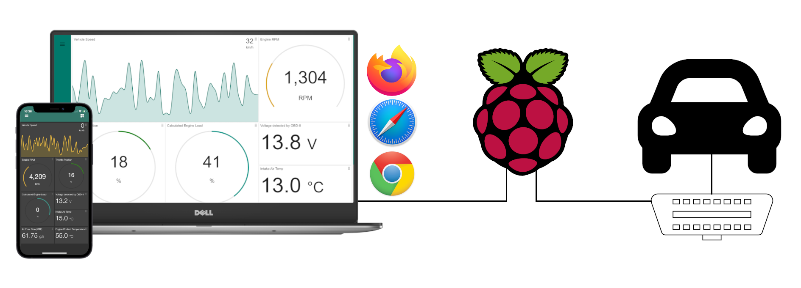
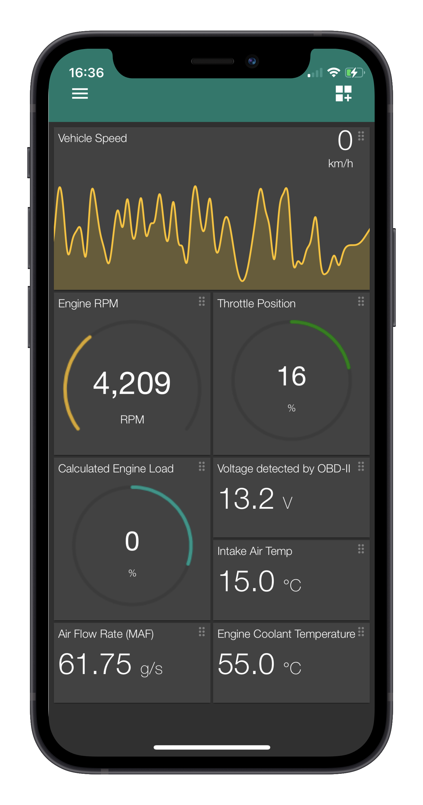
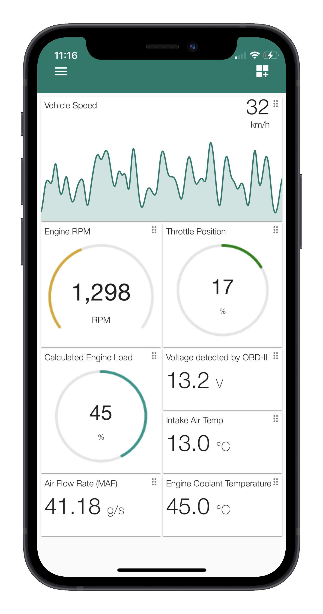
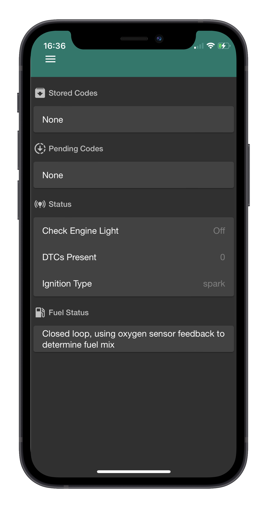
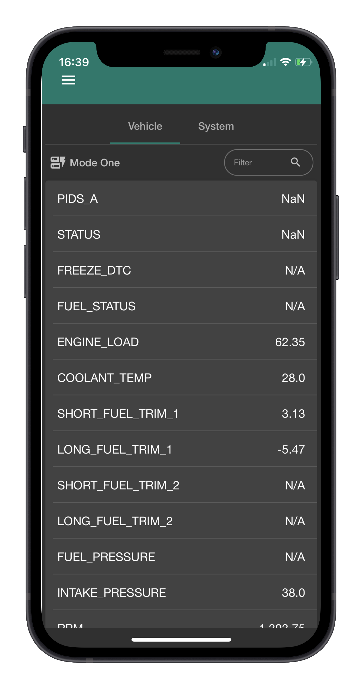
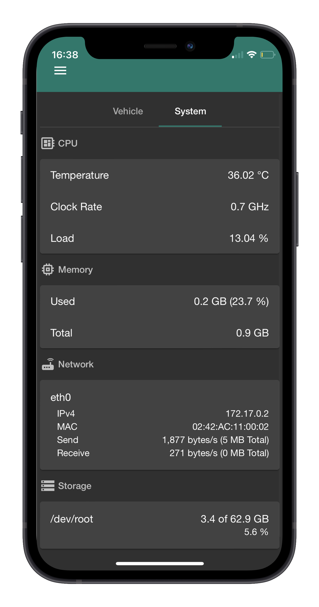
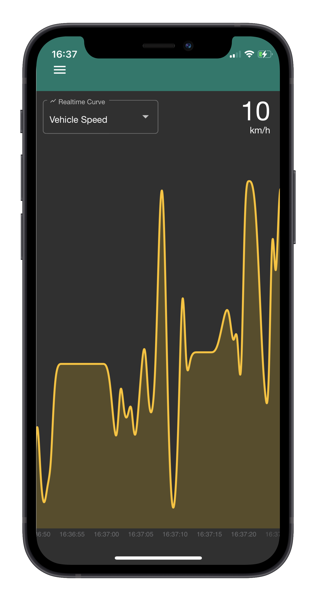
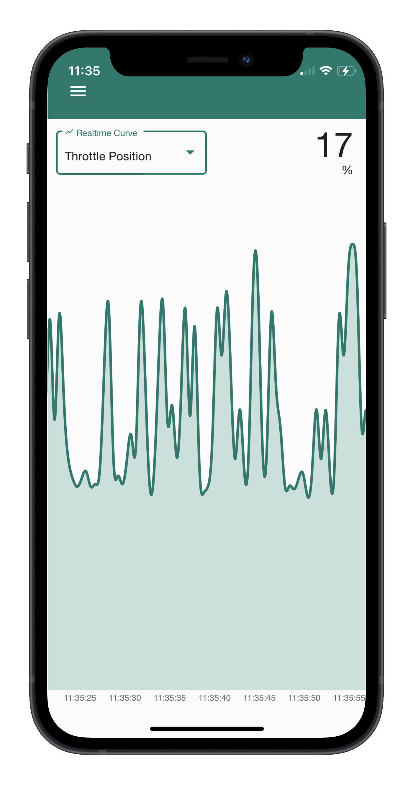
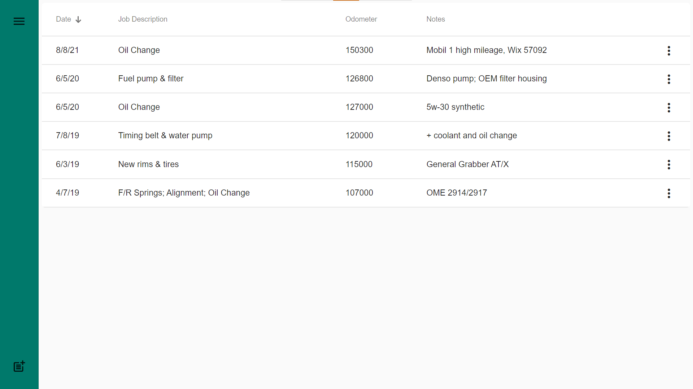

# OnBoardPi

OnBoardPi is the perfect project if you have a Raspiberry Pi (or other SBC) collecting dust and like to work on your car. It combines hardware and software to provide a unique way of monitoring your vehicles performance and health and can be used as a start point for turing any vehicle into a "smart car". Your OnBoardPi will host a web server which uses the websocket protocol to relay OBD (On Board Diagnostics) data to any device in realtime.



## Features

- Access from any device that runs a modern and capable web broswer, no need to download any unknown OBDII apps
- Dark and light modes
- Lightweight and customizable
- Keep all your vehicle data close and accessible 

*Screenshots were taken from a testing environment and do not reflect actual data.*

Thanks to [MockuPhone](https://mockuphone.com/) for the device mock-ups.

### Dashboard 
- Visualize gauges, curves or numeric cards in real time.
- Choose from any Mode 1 OBDII PID.
- Reorder dashboard cards
<div align="center">
    
</div>


### Diagnostics
- View stored, pending or freeze DTCs (diagnostic trouble codes) where supported.
- View current status and fuel status, if supported.

<div align="center">
    
</div>

*Clearing codes not supported yet*

### Data Stream
- View all (mode 1) OBDII PIDs at once
- View realtime system parameters including CPU, RAM and disk usage. Screenshots below were not from a Raspberry Pi.

<div align="center">
    
</div>

### Realtime Curves
- Fullscreen real time depiction of any supported OBDII commands

<div align="center">
    

</div>


### Maintenance
- Store your vehicle maintenance in a convienient table (stored in a database on the Raspberry Pi)




## Set Up

This project is intended to be cost effective, while you do not need the most expensive hardware it is still recommended that you use reliable components and only cheap out where possible.

### What's Needed

- **A Raspiberry Pi** or comparable Single Board Computer with >= 1 GB of RAM.
- **An OBDII adapter**, I recommend the [OBDLink SX](https://www.obdlink.com/products/obdlink-sx/) which provides a reliable USB connection to the Pi. Bluetooth models may be used from Amazon for example but I have not had great success paring them with the Pi.
- **A 12VDC to 5VDC power converter** - car batteries will fry any SBC without a way to step the voltage down to ~5V. Here are a few examples of converters:
    - [DC-DC Buck Converter](https://www.amazon.ca/gp/product/B074J4DLWQ/ref=ppx_yo_dt_b_asin_title_o07_s00?ie=UTF8&psc=1) - adjustable, cheap and effiecient.
    - [DC-DC 12V to 5V 3A](https://www.amazon.ca/gp/product/B07H7X37T6/ref=ppx_yo_dt_b_asin_title_o01_s00?ie=UTF8&psc=1) - non-adjustable but enclosed (somewhat waterproof) and micro-USB, so a micro-USB to USB C adapter is needed.

- **A relay, switch or button** to implement a graceful shutdown circuit for the Pi. If the Pi is powered via ignition you risk corruption when you shut the car (and the Pi) off with the key. So you need to alert the Pi beforehand with accessory power (ACC) that it is time to safely shutdown. I will have more in-depth info on this in the future.

### Installation
Once your Pi is physically ready to be installed in your car there are a few things that need to be worked out. Since OnBoardPi uses a web-server to push OBD data to connected devices, you will need some sort of LAN within your car. We have a few options:

1. You have an Android car stereo or a vehicle with a WiFi hotspot. This method does not take any more setup than the Pi and the software itself, just connect your Pi to the existing network and you are good to go.
2. Use your phone's cellular hotspot. At the moment, OnBoardPi does not require any internet connection so it will not use your data plan. Set up your personal hotspot on your phone and connect the Pi, you will need to know the IP address of the Pi for this method to work so use an app like [Network Analyzer](https://techet.net/netanalyzer/) to scan for devices connected to the hotspot. Further you can configure the Pi to have a static IP on ths hotspot so you do not have to scan for it each time. This option will be handy in the future when OnBoardPi supports cloud backups so it can use a cellular plan to make backups.
3. Use the Pi itself as a wireless hotspot. I use [Autohotspot](https://www.raspberryconnect.com/projects/65-raspberrypi-hotspot-accesspoints/183-raspberry-pi-automatic-hotspot-and-static-hotspot-installer) which allows you to configure the Pi to connect to any known network within range and fallback to being a hotspot. So when you are parked at home in your router's range, the Pi can have internet access, but if you are driving around the Pi will create its own network allowing you to access the OnBoardPi web page.

#### Using Docker
If you like and use Docker you can pull the latest OnBoardPi image from DockerHub. Then run it as a systemd service like [this](https://gist.github.com/bgunson/690b5024fcc11d8f824196950ebb0609).
```
docker pull bgunson/onboardpi:latest
```
To run the image:
```
docker run -d -p 8080:8080 -p 60000:60000 -v /etc/obpi:/etc/obpi -v /dev:/dev --name OBPI bgunson/onboardpi:latest
```
- `-p 8080:8080` makes the main web server accessble on the Pi's port 8080. To use any other port do `80:8080` for example but do not change the container port from 8080 unless you set enviroment variable `PORT`.
- `-p 60000:60000` is the port mapping for the OBD server, DO NOT alter this option.
- `-v /etc/obpi:/etc/obpi` mounts the location for the databse and settings, thus all data will be on the Pi @ `/etc/obpi` locally.
    - You may also use a regular docker volume if desired.
- `-v /dev:/dev` makes the serial port for (OBD adapter) accessble within the container, DO NOT remove or alter.

#### From the Source

**Requires**
- Node>=v14 (and npm)
- python>=3.8 (and python3-pip)

First clone this repository
```
git clone <repo>
```
Change directories to the cloned folder. Next install needed node and python modules.
```
npm install
pip install -r requirements.txt
```
Now for the client.
```
cd client-src
npm install
npm run build
```
To run OnBoardPi
```
node app.js
```
From there you can define a systemd service to run OnBoardPi as a service.

When running, determine the IP address of the Pi once connected to the same network it is on and navigate to the web page in  abrowser by inputting the Pi's IP address and port of the web server, such as `192.168.1.101:8080`. From there you can connect to the car via OBDII.

Tip: after successfully navigating to the web page bookmark the site to your home screen which caches the site and opens it as a standalone PWA (progressive web app).

## Related Projects and Thanks to
OnBoardPi is not possible without open-source culture and the projects below but not limited to:
- [ngx-graph](https://github.com/jkuri/ngx-graph)
- [ngx-gauge](https://github.com/ashish-chopra/ngx-gauge)
- [ngx-socket-io](https://github.com/rodgc/ngx-socket-io)
- [systeminformation](https://github.com/sebhildebrandt/systeminformation)
- [python-OBD](https://github.com/brendan-w/python-OBD)
- [ELM-emulator](https://github.com/Ircama/ELM327-emulator)
